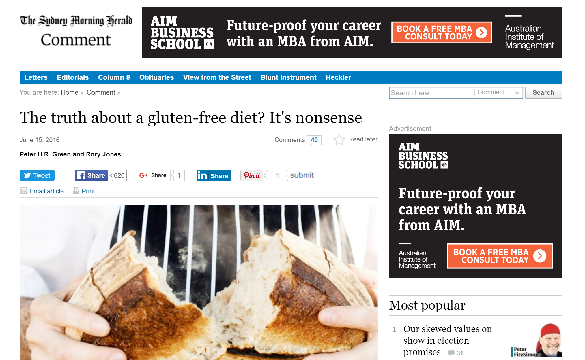

# Preamble

<div class="notes">
</div>

## Statistics - Freedman, Pisani and Purves

* **Chapter 1** Controlled experiments
* **Chapter 2** Observational studies
* **Chapter 3** The histogram
* **Chapter 4** The average and the standard deviation
* **Chapter 5** The normal approximation for data
* **Chapter 6** Measurement error
* **Chapter 7** Plotting points and lines
* **Chapter 8** Correlation
- &nbsp;&nbsp;&nbsp;&nbsp; 1. The scatter diagram
- &nbsp;&nbsp;&nbsp;&nbsp; 2. The correlation coefficient
- &nbsp;&nbsp;&nbsp;&nbsp; 3. The SD line
* **Chapter 9** More about correlation


<div class="notes">
- New curriculum is structured around FPP.
- Data driven approach to introduce correlation.
- Assume that students have experience using visualization to describe properties of a variable.
- Understand concepts of variation 
</div>


```{r, echo=FALSE}
#Read in the nutrition data
nutritionData = read.csv('AUSNUT 2011-13 AHS Food Nutrient Database.csv')

#Focus on the breakfast cereals
cereals = grep('Breakfast cereal',nutritionData[,'Food.Name'])
data = nutritionData[cereals,]

#remove breakfast beverages
data = data[-grep('beverage',data[,'Food.Name'],ignore.case = TRUE),]

#Only consider a few of the nutritional values
bigVar = c("Energy..with.dietary.fibre..kJ.","Added.sugars..g.",'Available.carbohydrates..with.sugar.alcohols..g.','Protein..g.','Total.fat..g.','Dietary.fibre..g.')
rownames(data) = data$Food.Name
data = data[,bigVar]
colnames(data) = c('Energy','Added.Sugar','Carbohydrates','Protein','Fat','Fibre')

```


# Correlation | The scatter plot

<div class="notes">
</div>

## Review  

- Frequency tables
- Histograms & barplots
- Summary measures

<div class="notes">
- Tabulating information.
- Visualising data.
- Mean and variance to describe the location and spread of a variable.
- Previous methods were good for dealing with one variable at a time.
</div>

## What if we have two variables? 

> - How do X and Y relate to each other?

## What if we have two variables? {.columns-2}

<center> Quantitative vs Quantitative </center>

```{r ctscts, echo=FALSE,warning = FALSE,results='asis'}

suppressMessages(library(shiny))
suppressMessages(library(xtable))
suppressMessages(library(pander))

set.seed(123)
x = data.frame(i = 1:10, 'X_i' = round(rnorm(10,10),1),'Y_i'= round(rnorm(10,10),1))

tab = paste0("$$",print(xtable(x,align = 'cc|cc',digits=1), type = "latex", include.rownames = F,floating=FALSE, tabular.environment="array", comment=FALSE, print.results=FALSE), "$$")
tab = gsub('\\\\_','_',tab)
cat(tab)

```


- Height and weight for individuals.
- Testosterone levels and race times for athletes.
- Sun exposure and number of branches for plants.


<div class="notes">
- We can tabulate the information.
</div>

## What if we have two variables? {.columns-2}

<center> Qualitative  vs  Quantitative </center>

```{r qualcts, echo=FALSE,warning = FALSE,results='asis'}

set.seed(123)
x = data.frame(i = 1:10, 'X_i' = sample(c('A','B'),10,replace = TRUE),'Y_i'= round(rnorm(10,10),1))

tab = paste0("$$",print(xtable(x,align = 'cc|cc',digits=1), type = "latex", include.rownames = F,floating=FALSE, tabular.environment="array", comment=FALSE, print.results=FALSE), "$$")
tab = gsub('\\\\_','_',tab)
cat(tab)

```

- Eye color and vision scores for individuals.
- Industry and share price volatility for businesses.
- State and student ATAR scores for universities. 


<div class="notes">
</div>


## What if we have two variables? {.columns-2}

<center> Qualitative  vs  Qualitative </center>


```{r qualqaul, echo=FALSE,warning = FALSE,results='asis'}

set.seed(123)
x = data.frame(i = 1:10, 'X_i' = sample(c('A','B'),10,replace = TRUE),'Y_i'= sample(c('X','Y','Z'),10,replace = TRUE))

tab = paste0("$$",print(xtable(x,align = 'cc|cc',digits=1), type = "latex", include.rownames = F,floating=FALSE, tabular.environment="array", comment=FALSE, print.results=FALSE), "$$")
tab = gsub('\\\\_','_',tab)
cat(tab)

```

- Political preference and suburb for voters.
- Favourite music genre and shirt color for music fan.
- Car brand and shampoo choice for customer.


<div class="notes">
</div>

## How do X and Y relate to either? {.flexbox .vcenter}

Quantitative vs Quantitative

```{r ctscts, echo=FALSE,warning = FALSE,results='asis'}
```

<div class="notes">
- The approach we use for relating to variables together depends on whether they are quantitive or qualitative.
- We will focus on quantitative vs quantitative.
</div>

## Data example {.flexbox .vcenter}



<div class="notes">
- Today's data example was motivated by news article by Dr Green and the celiac disease center at Columbia University in new York.
- Cutting gluten out of diet can reduce nutrients.
</div>

## Data example {.flexbox .vcenter}


<div class="notes">
</div>

## How can we find out if our cereal is "good" to eat?


<div class="notes">
- Look at nutrient break downs on packaging.
- Can write data in table.
- Hard to see how different cereals relate to each other in table.
</div>


## How can we find out if our cereal is "good" to eat?

- Australian food nutrient database
- <a href="http://www.foodstandards.gov.au/science/monitoringnutrients/ausnut/ausnutdatafiles/Pages/foodnutrient.aspx">http://www.foodstandards.gov.au</a>
- 5740 foods
- 54 nutrients
- 117 are breakfast cereals

<div class="notes">
- Australian government tracks nutrient contents for a variety of foods.
- Data is publicly available.
</div>

## Scatter plot {.flexbox .vcenter .build}

- What is the relationship between *Energy (Kilojoules)* and the amount of *added sugar*?


```{r,echo =FALSE,fig.height=4.5,fig.width=4.5,warning=FALSE}
library(ggplot2)
p1 <- ggplot(data, aes(x=Added.Sugar, y=Energy)) +
  geom_point(color = "#56B4E9",size = 3) + theme_bw()
p1

```

<div class="notes">
- Break down construction of histogram
- Vertical axis and the yaxis, horizontal axis the xaxis
- For each point on the plot  represents the amount of added sugar and energy
- Convention, xaxis independent variable, yaxis dependant variable
</div>

## Scatter plot {.flexbox .vcenter}

```{r,echo =FALSE,fig.height=4.5,fig.width=4.5,warning=FALSE}
p1

```


## Scatter plot {.flexbox .vcenter}

```{r,echo =FALSE,fig.height=4.5,fig.width=4.5,warning=FALSE}
 p1+stat_ellipse(type = "norm",col = "#56B4E9",size = 2,level = .55)
```

<div class="notes">
Data is a swarm of points.

</div>


## Differences in association {.flexbox .vcenter}

```{r,echo =FALSE,fig.height=3.5,fig.width=10,warning=FALSE}
set.seed(123)
multiplot <- function(..., plotlist=NULL, cols) {
    require(grid)

    # Make a list from the ... arguments and plotlist
    plots <- c(list(...), plotlist)

    numPlots = length(plots)

    # Make the panel
    plotCols = cols                          # Number of columns of plots
    plotRows = ceiling(numPlots/plotCols) # Number of rows needed, calculated from # of cols

    # Set up the page
    grid.newpage()
    pushViewport(viewport(layout = grid.layout(plotRows, plotCols)))
    vplayout <- function(x, y)
        viewport(layout.pos.row = x, layout.pos.col = y)

    # Make each plot, in the correct location
    for (i in 1:numPlots) {
        curRow = ceiling(i/plotCols)
        curCol = (i-1) %% plotCols + 1
        print(plots[[i]], vp = vplayout(curRow, curCol ))
    }

}

dat = data.frame(Added.Sugar = data$Added.Sugar, Energy = (rnorm(length(data$Added.Sugar),data$Added.Sugar,16) )*sd(data$Energy)/sd(data$Added.Sugar)- mean(data$Added.Sugar)+mean(data$Energy))
p2 <- ggplot(dat, aes(x=Added.Sugar, y=Energy)) +
  geom_point(color = "#56B4E9",size = 3) + theme_bw() + ggtitle('Less association')+xlim(c(-5,42))


dat = data.frame(Added.Sugar = data$Added.Sugar, Energy = (rnorm(length(data$Added.Sugar),data$Added.Sugar,4) )*sd(data$Energy)/sd(data$Added.Sugar)- mean(data$Added.Sugar)*4+mean(data$Energy))
p3 <- ggplot(dat, aes(x=Added.Sugar, y=Energy)) +
  geom_point(color = "#56B4E9",size = 3) + theme_bw()+ ggtitle('More association')+xlim(c(-5,42))

dat = data.frame(Added.Sugar = data$Added.Sugar, Energy = sample(data$Energy,length(data$Energy)))
p4 <- ggplot(dat, aes(x=Added.Sugar, y=Energy)) +
  geom_point(color = "#56B4E9",size = 3) + theme_bw()+ ggtitle('No association')+xlim(c(-5,42))

suppressMessages(multiplot(p3, p2,p4, cols=3))

```

<div class="notes">
</div>

## Differences in association {.flexbox .vcenter}

```{r,echo =FALSE,fig.height=3.5,fig.width=10,warning=FALSE}
set.seed(123)
multiplot <- function(..., plotlist=NULL, cols) {
    require(grid)

    # Make a list from the ... arguments and plotlist
    plots <- c(list(...), plotlist)

    numPlots = length(plots)

    # Make the panel
    plotCols = cols                          # Number of columns of plots
    plotRows = ceiling(numPlots/plotCols) # Number of rows needed, calculated from # of cols

    # Set up the page
    grid.newpage()
    pushViewport(viewport(layout = grid.layout(plotRows, plotCols)))
    vplayout <- function(x, y)
        viewport(layout.pos.row = x, layout.pos.col = y)

    # Make each plot, in the correct location
    for (i in 1:numPlots) {
        curRow = ceiling(i/plotCols)
        curCol = (i-1) %% plotCols + 1
        print(plots[[i]], vp = vplayout(curRow, curCol ))
    }

}

dat = data.frame(Added.Sugar = data$Added.Sugar, Energy = (rnorm(length(data$Added.Sugar),data$Added.Sugar,16) )*sd(data$Energy)/sd(data$Added.Sugar)- mean(data$Added.Sugar)+mean(data$Energy))
p2 <- ggplot(dat, aes(x=Added.Sugar, y=Energy)) +
  geom_point(color = "#56B4E9",size = 3) + theme_bw() + ggtitle('Less association')+stat_ellipse(type = "norm",col = "#56B4E9",size = 2,level = .8)+xlim(c(-5,42))


dat = data.frame(Added.Sugar = data$Added.Sugar, Energy = (rnorm(length(data$Added.Sugar),data$Added.Sugar,4) )*sd(data$Energy)/sd(data$Added.Sugar)- mean(data$Added.Sugar)*4+mean(data$Energy))
p3 <- ggplot(dat, aes(x=Added.Sugar, y=Energy)) +
  geom_point(color = "#56B4E9",size = 3) + theme_bw()+ ggtitle('More association')+stat_ellipse(type = "norm",col = "#56B4E9",size = 2,level = .8)+xlim(c(-5,42))

dat = data.frame(Added.Sugar = data$Added.Sugar, Energy = sample(data$Energy,length(data$Energy)))
p4 <- ggplot(dat, aes(x=Added.Sugar, y=Energy)) +
  geom_point(color = "#56B4E9",size = 3) + theme_bw()+ ggtitle('No association')+stat_ellipse(type = "norm",col = "#56B4E9",size = 2,level = .8)+xlim(c(-5,42))

multiplot(p3, p2,p4, cols=3)

```

<div class="notes">
</div>

## Prediction {.flexbox .vcenter}

```{r,echo =FALSE,fig.height=4.5,fig.width=4.5,warning=FALSE}
 p1
```

<div class="notes">
</div>

## Prediction {.flexbox .vcenter}

```{r,echo =FALSE,fig.height=4.5,fig.width=4.5,warning=FALSE}
 p1+ geom_smooth(method=lm,se=FALSE,col = 'gray',linetype = 1,size = 1.2)
```

<div class="notes">
</div>

## Prediction {.flexbox .vcenter}

```{r,echo =FALSE,fig.height=4.5,fig.width=4.5,warning=FALSE}
 p1+ geom_smooth(method=lm,se=FALSE,col = 'gray',linetype = 1,size = 1.2)+ geom_vline(xintercept = c(14,16),linetype = 2)
```

<div class="notes">
</div>


## Exploring more variables {.flexbox .vcenter}

```{r,echo =FALSE,out.height=550,out.width=550,fig.width=7,fig.height=7}
library(pairsD3)
pairsD3(data,leftmar = 22,col = "#56B4E9",opacity = 0.8)
```


<div class="notes">
</div>

## Summary {.build}

We can use scatter plots for visualation of two variables

> - We can use our eyes...

  - &nbsp;&nbsp;&nbsp;&nbsp;&nbsp; 1. to test a hypothesis.
  - &nbsp;&nbsp;&nbsp;&nbsp;&nbsp; 2. to make a prediction.
  - &nbsp;&nbsp;&nbsp;&nbsp;&nbsp; 3. to explore a set of data.

> - Caveats

  - &nbsp;&nbsp;&nbsp;&nbsp;&nbsp; 1. We often see what we want to see.
  - &nbsp;&nbsp;&nbsp;&nbsp;&nbsp; 2. A plot does not quantify a relationship.
  - &nbsp;&nbsp;&nbsp;&nbsp;&nbsp; 3. We can only look at so many plots.

<div class="notes">
</div>


## Epilogue

- Presentation generated with ioslides in RStudio.
- Fully reproducable.
- Available on github:
- https://github.com/ellispatrick/Presentations/Teaching

## R version

```{r}
sessionInfo()
```

